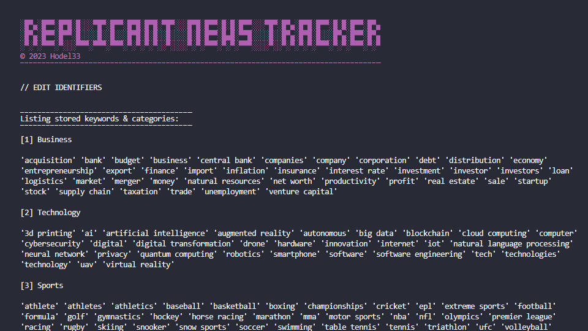

# Replicant News Tracker


## 📋 Overview

Replicant News Tracker is a terminal-based app designed to provide insightful analytics from various news sources. It scrapes news articles, processes the textual data by removing stopwords and punctuations, and stores the refined content in an SQLite database. Utilizing Python's data analysis and visualization libraries, the application generates meaningful charts to offer valuable insights into the news landscape.

### 🌟 Features

- **Multi-Source News Scraping:** Supports scraping from multiple news outlets (user-defined configurations for targeted scraping).
- **Comprehensive HTML Filtering**: The scraping process employs flexible, regular-expression-based filtering to selectively extract relevant article content, while excluding irrelevant information like image captions, promotional texts, or any unwanted tags. It also checks for a minimum paragraph count, ensuring that only substantial articles are processed further.
- **Text Processing:** Cleans article text by removing stopwords and punctuations.
- **SQLite Storage:** Utilizes a custom SQLite context manager for efficient database operations.
- **Insightful Data Analysis:** In-depth analytics, offering visualizations for top keywords, categories, keyword trends over time, and geographical mentions. It categorizes articles by domain and date, and performs comprehensive keyword counting to offer unique insights into your scraped articles.
- **Interactive HTML Graphs:** Generate and interact with various dynamic plots including bar graphs, pie charts, scatter plots, and heatmaps for enhanced data visualization and analysis.
- **Pagination Support:** The scraper efficiently handles HTML pagination and dynamically adjusts the scraping URL to fit the structure of each different website.
- **Keyword Filtering:** Comes with predefined categories and keywords for specialized article analysis, while also allowing users to add their own custom keywords and categories.
- **Scheduled Runs:** Comes with batch files for automated, scheduled runs on Windows and macOS/Linux.
- **Error Handling/Logging:** Features robust error-handling mechanisms including exponential backoff in its retry logic for efficient handling of transient errors and rate limits. Additionally, meaningful errors and logs are generated for exceptional situations.
- **User-friendly Interface:** Easy-to-use command-line interface (CLI) integrated with custom-designed real-time progress bars, thanks to the tqdm package. These progress bars are tailored to match the CLI design and are visible during all scraping activities, chart generation, and data calculations, elevating the overall user experience.

<br>

## ⚙️ Installation

### Prerequisites

1. 🐍 **Python**: This application is written in Python. It is recommended to have the latest version of Python installed. You can download it from [Python's official website](https://www.python.org/downloads/).

2. 🖋️ **IDE**: For code editing, [VS Code (Visual Studio Code)](https://code.visualstudio.com/) is recommended. Enhance your Python experience by adding the [Python extension](https://marketplace.visualstudio.com/items?itemName=ms-python.python).

3. 🔍 **SQLite Extension (Optional)**: For easier overview and editing of SQLite databases, it's good to have an SQLite extension. [@yy0931's SQLite3 Editor for VSCode](https://marketplace.visualstudio.com/items?itemName=yy0931.vscode-sqlite3-editor) is highly recommended.

### Steps

1. **Clone the Repository**:  
   Clone this GitHub repository to your local machine.
   ```bash
   git clone https://github.com/hodel33/replicant-news-tracker.git
   ```

2. **Navigate to Project Directory**:  
   Open a terminal and navigate to the directory where you've cloned the repository.
   ```bash
   cd path/to/replicant-news-tracker
   ```

3. **Install Dependencies**:  
   Run the following command to install the required Python packages from `requirements.txt`.
   ```bash
   pip install -r requirements.txt
   ```

4. **Run the Application**:  
   Execute `main.py` to start the application.
   ```bash
   python main.py
   ```
   
<br>

## 🚀 Usage (Running the app)

### Main Menu

After launching the application, you'll be greeted by the main menu where you can navigate to different functionalities.


---

### 1. Scrape & Store Data

- **How to Access**: Choose option `1` from the Main Menu.
- **Functionality**: This feature allows you to scrape articles from multiple websites.
  
  1. Specify the pagination level you wish to scrape, choosing a number between 1 and 15.
  2. The scraping process will commence, and the scraped data will be stored in a local database.


---

### 2. Analyze Saved Data

> **Note:** Files are automatically exported to the `/exports` folder.

- **How to Access**: Choose option `2` from the Main Menu.
- **Functionality**: Allows you to analyze the data you have scraped.

  1. **Top Keywords**: Generates charts for the most frequently occurring keywords.
  2. **Custom Keywords**: Allows for a single keyword analysis or a comparison between two keywords.
  3. **Top Categories**: Shows charts for the most frequent categories.
  4. **Country Mentions**: Generates a heatmap for mentions of countries in the articles.
  5. **Export Stored Articles**: Exports all stored article URLs to a txt file.
  6. **Scrape Statistics**: Provides statistics about your previous scrapes.


---

### 3. Edit Identifiers

- **How to Access**: Choose option `3` from the Main Menu.
- **Functionality**: Manages keywords and categories that are used for analysis.

  1. **Show Keywords/Categories**: Lists all the existing keywords and categories.
  2. **Add Keyword/Category**: 
     - For categories, type the name of the new category.
     - For keywords, select a category first and then type the keyword.
  3. **Delete Keyword/Category**: 
     - For categories, type the name or ID of the category to delete.
     - For keywords, select a category first and then type the name or ID of the keyword to delete.




<br>

## 🔧 Usage (Configuration)

### Site Scraping Configurations

> **Note:** This scraper is designed to work only on news websites that are free and do not require subscription models.

The scraper is highly configurable and designed to work with multiple news outlets. Below is a sample configuration for a news site found in `data_init.py`.

```python
{
  "domain": "vox.com",
  "pages": ["/", "/world-politics"],
  "url_filter": r"/\d+/\d+/\d+/",
  "url_exclusion": ["/videos/", "/podcasts/"],
  "div_filter": r"c-entry-content",
  "p_attr_exclusion": ["c-article", "amount", "contributed", "c-read-more"],
  "pagin_filter": "c-pagination"
}
```

- **domain**: The base URL of the news site.
- **pages**: The specific pages to scrape ("/" is the main page).
- **url_filter**: A regular expression to identify article URLs.
- **url_exclusion**: Filters for URLs to be excluded.
- **div_filter**: A regular expression filter used to identify the HTML class or ID containing the main article content.
- **p_attr_exclusion**: A list of HTML classes or IDs to exclude when scraping the article content. Useful for ignoring paragraphs that contain advertisements, promotional links, or other non-relevant information.
- **pagin_filter**: A filter to identify pagination links on the web page. The scraper first attempts to find a match using a regular expression. If that fails, it looks for an "aria-label" attribute in the "a" tag. Finally, if both methods fail, it looks for a class name that contains a "?" in its href attribute.

<br>

## 🔄 Usage (Batch run)

> **Note:** Make sure you have the necessary permissions to execute these scripts.

The scraper comes with a batch run feature that allows you to run scraping operations automatically at scheduled times. Below are the setup details for Windows, macOS, and Linux.

### Windows

1. Locate the `scheduled_scraper.bat` file in the project directory.
2. Double-click on the batch file to run it, or schedule it using Windows Task Scheduler.

**Content of `scheduled_scraper.bat`:**

```batch
@echo off
python.exe "%~dp0\scheduled_scraper.py"
```

### macOS/Linux

1. Locate the `scheduled_scraper.sh` file in the project directory.
2. Open Terminal, navigate to the project directory, and run `chmod +x scheduled_scraper.sh`.
3. Use `cron` or another scheduler to set up the script to run at your desired intervals.

**Content of `scheduled_scraper.sh`:**

```bash
#!/bin/bash
python3 "$(dirname "$0")/scheduled_scraper.py"
```

### Logging

After the batch run is completed, the application will log the number of new articles stored in the database, along with the ones that were omitted. This information is saved in a file called `scheduled_scraper.txt` in the following format:

```text
------------------
2023-09-03 14:15
------------------
Successfully stored 20 new article(s) in the database (3 were omitted).
```

To enable this feature, make sure the `batch` parameter is set to `True` when calling the `scrape_all_sites` method from `scheduled_scraper.py`.

```python
ns = NewsScraper()
ns.scrape_all_sites(pagin_amount=5, debug_mode=False, batch=True)
```

<br>

## ⚠️ Troubleshooting

### Debug Mode

The scraper features a verbose Debug Mode for advanced troubleshooting and development purposes. When activated, this mode provides real-time logs for each crucial step of the scraping process. This includes:

- The status code for each HTTP request.
- The current pagination level.
- The dynamic modification of pagination URLs for the next scraping iteration.
- The number of paragraphs found in the main content area.
- Attributes of each paragraph for spotting unnecessary promotional texts or other unwanted content.

To enable Debug Mode, simply set the `debug_mode` parameter to `True` when calling the `scrape_all_sites` method.

```python
self.scrape_all_sites(pagin_amount=input_pagin_amount, debug_mode=True)
```

This feature is particularly helpful for identifying issues such as missing or empty content, incorrect URL patterns, or understanding how the scraper navigates through pagination and filters out irrelevant information.<br>
Example:


### Common Issues

**Issue**: Scraping process halts unexpectedly or skips specific domains/pages.  
**Solution**: Refer to the "scraper_log.txt" logs for any error messages. For a more detailed examination, enable Debug Mode.

**Issue**: Some articles are not saved in the database and are instead placed in the "exclude_articles" table.  
**Solution**: Verify the `div_filter` and `p_attr_exclusion` settings for each website in `data_init.py`. It's also possible that some articles lack sufficient quality content to warrant saving.


**Issue**: HTML chart plots are not displaying as expected.  
**Solution**: Make sure you are using the latest version of your web browser and have JavaScript enabled.

**Issue**: Scheduled scraping runs are not executing.  
**Solution**: Confirm that the batch files are set up correctly and that you have the required permissions to execute them.

<br>

## 📜 License

This project is licensed under a Custom License - see the [LICENSE](LICENSE) file for details. The license restricts the use of the software to personal, non-commercial purposes and prohibits the sale of the software.

### Summary:

1. **Personal Use**: The software can be used for personal, non-commercial use.
2. **Distribution**: Distribution or inclusion in larger software distributions is allowed only with prior written permission.
3. **No Warranty**: The software is provided "as is", without any warranty.

For the full license, please refer to the [LICENSE](LICENSE) file in the repository.

<br>

## 💬 Feedback & Contact

I'd love to network, discuss tech, or swap music recommendations. Feel free to connect with me on:

🌐 **LinkedIn**: [Björn Hödel](https://www.linkedin.com/in/bjornhodel)<br>
🐦 **Twitter**: [@hodel33](https://twitter.com/hodel33)<br>
📸 **Instagram**: [@hodel33](https://www.instagram.com/hodel33)<br>
📧 **Email**: [hodel33@gmail.com](mailto:hodel33@gmail.com)
